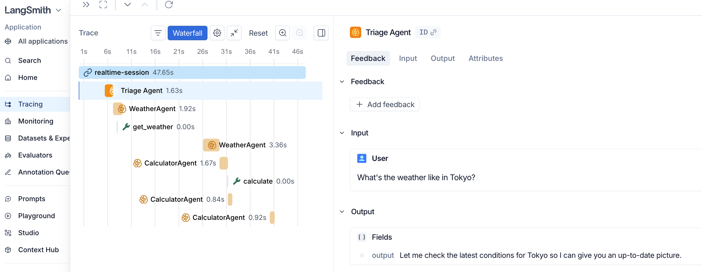
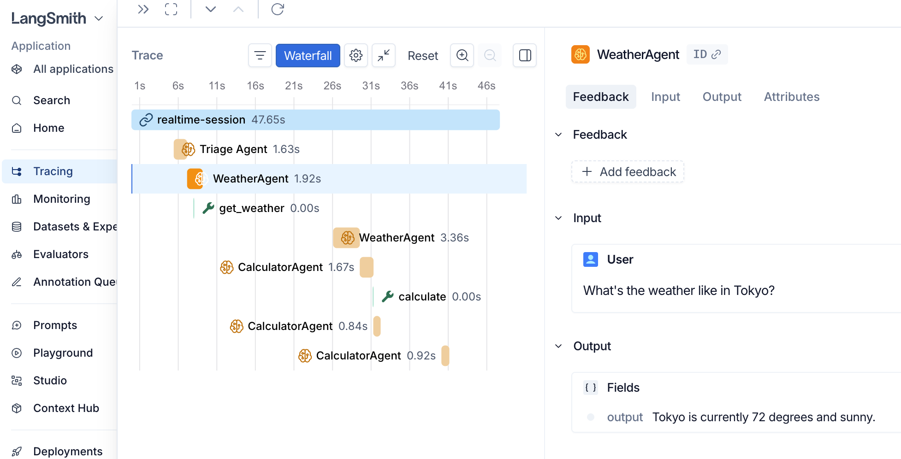
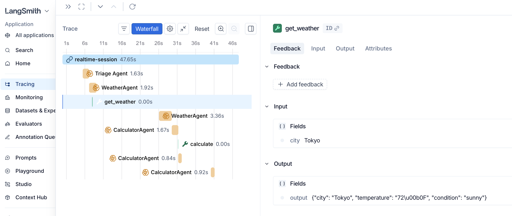
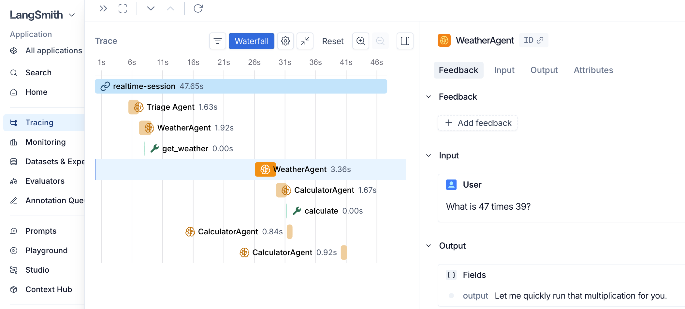
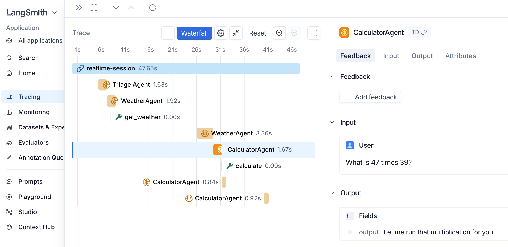
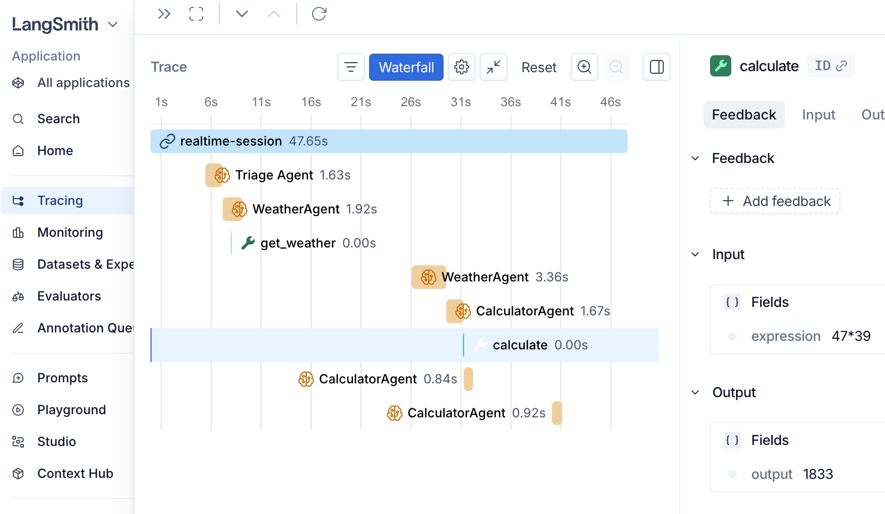
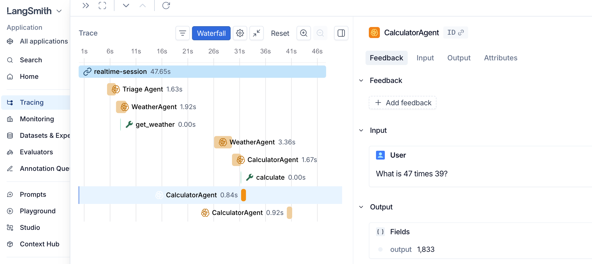
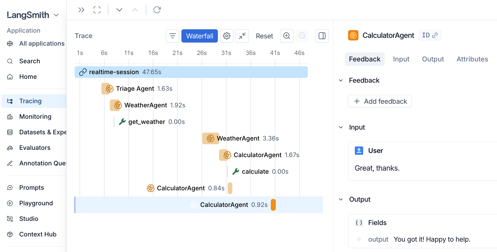

# OpenAI Agent SDK Realtime Demo

A voice-driven multi-agent demo built on the OpenAI Agents SDK Realtime API. A triage agent listens to your mic and routes requests to one of four specialist agents: Weather, Calculator, Python Code Runner, or File Writer.

## Requirements

- Python **3.13+**
- [`uv`](https://docs.astral.sh/uv/getting-started/installation/) (fast Python package manager)
- A microphone and speakers
- An OpenAI API key with Realtime API access

### Platform notes for PyAudio

`pyaudio` needs PortAudio installed on your system:

- **macOS**: `brew install portaudio`
- **Ubuntu/Debian**: `sudo apt-get install portaudio19-dev python3-pyaudio`
- **Windows**: usually works out of the box via the prebuilt wheel — no extra steps

## Setup

```bash
# 1. Install uv if you don't have it
#    macOS/Linux:  curl -LsSf https://astral.sh/uv/install.sh | sh
#    Windows:      powershell -c "irm https://astral.sh/uv/install.ps1 | iex"

# 2. Install dependencies (creates a .venv automatically)
uv sync

# 3. Configure your API key
cp .env.example .env
# then edit .env and paste your OPENAI_API_KEY
```

## Find your audio device indices

```bash
uv run mic_detect.py
```

This prints something like:

```
Index 0: Microphone (Realtek Audio)
Index 1: Speakers (Realtek Audio)
Index 2: Headset Microphone
...
```

Pick the index for the mic you want to use and the index for the speaker you want to use.

## Run

```bash
# Uses default device indices (input=0, output=1)
uv run openai_agent_sdk_realtime.py

# Or pick specific devices
uv run openai_agent_sdk_realtime.py --input-device 2 --output-device 3
```

You should see:

```
--- Multi-Agent Session Active (Speak into mic) ---
Agents: Weather | Calculator | Python Code | File Writer
Triage agent will route your requests.
```

Talk into the mic. Press `Ctrl+C` to exit.

## Try it

- *"What's the weather in Tokyo?"* → routed to **WeatherAgent**
- *"What is 47 times 39?"* → routed to **CalculatorAgent**
- *"Write a Python script that prints the first ten Fibonacci numbers and run it."* → **PythonCodeAgent**
- *"Save a file at notes.txt that says hello world."* → **FileWriterAgent**

## LangSmith Traces

**Triage Agent** — routes the weather question and responds before handing off.


**WeatherAgent** — delivers the final weather answer after the tool call.


**get_weather tool** — raw input/output of the weather tool call (city → JSON).


**WeatherAgent (second query)** — triage hands off a math question to WeatherAgent, which passes it on.


**CalculatorAgent** — receives the math question and prepares to run the tool.


**calculate tool** — expression `47*39` evaluated, result `1833`.


**CalculatorAgent (after tool)** — speaks the result back to the user.


**CalculatorAgent (follow-up)** — handles a follow-up conversational turn ("Great, thanks.").

## Files

| File | Purpose |
| --- | --- |
| `openai_agent_sdk_realtime.py` | Main entry point — defines agents, handoffs, and the audio loop |
| `tool_definitions.py` | The four tool implementations |
| `mic_detect.py` | Lists available PyAudio input/output devices |
| `pyproject.toml` | Dependencies (managed by `uv`) |
| `.env.example` | Template for your `OPENAI_API_KEY` |

## Troubleshooting

- **`OSError: [Errno -9996] Invalid input device`** — wrong `--input-device` index. Re-run `uv run mic_detect.py` and pick a different one.
- **No audio playback** — same fix as above, but for `--output-device`.
- **`401 Unauthorized`** — your `OPENAI_API_KEY` is missing, invalid, or doesn't have Realtime API access. Confirm `.env` exists in this folder and contains a valid key.
- **PyAudio install fails on Linux** — install PortAudio first: `sudo apt-get install portaudio19-dev`.

